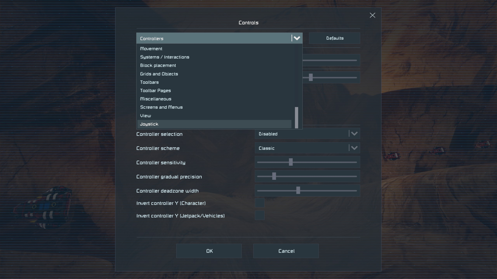
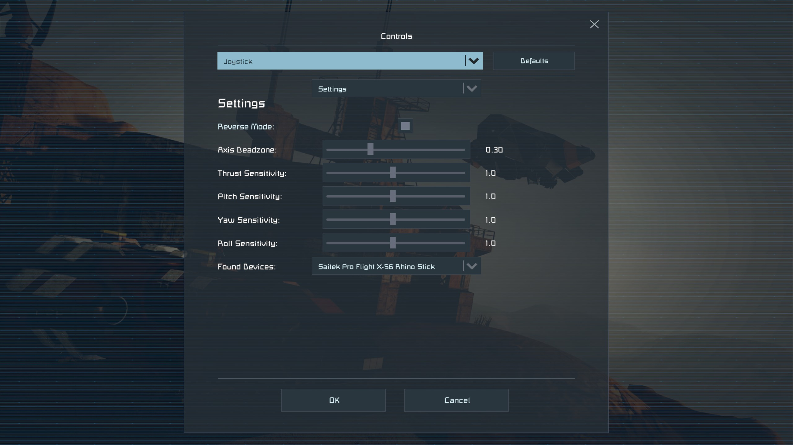
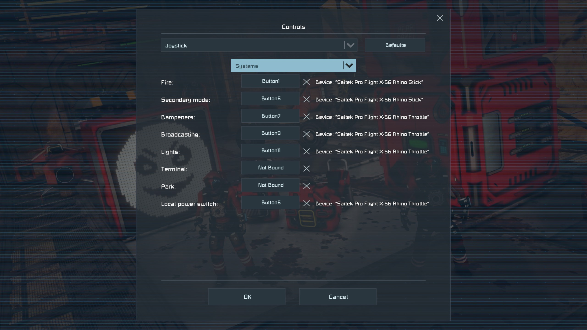
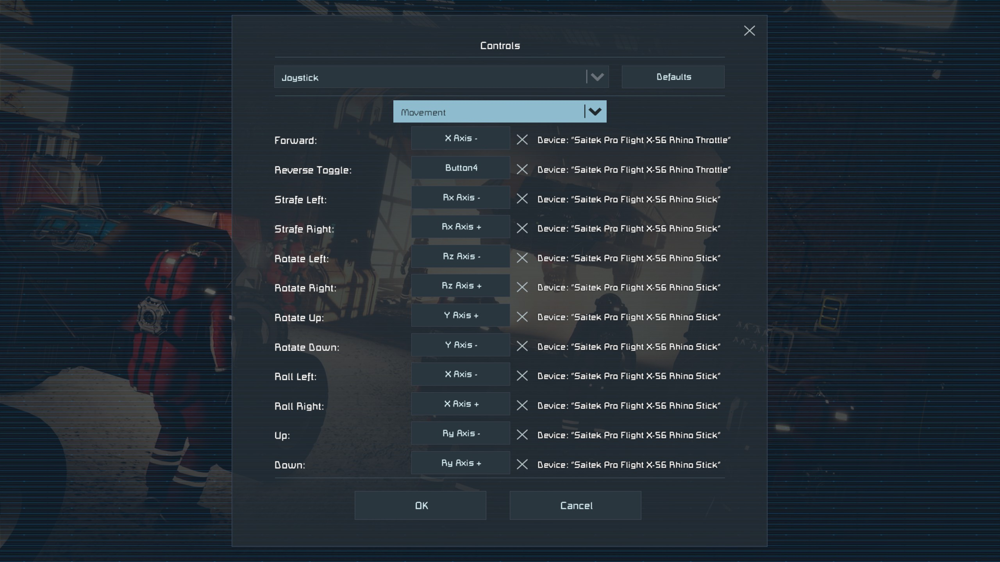

# Joystick & HOTAS Support Plugin  

**KEEEEN!!!** Joystick and HOTAS support has been long overdue—so here’s my plugin to finally add it.  

I’ve tested this on Keen’s official servers without any issues. Keep in mind, though, that some public servers may have their own restrictions or rules that could block plugins.  

---

## ✨ Features  
- Full **bindable controls** for joysticks and HOTAS devices.  
- **Sensitivity** and **deadzone** adjustments per axis.  
- Two reverse options:  
  - Assign an axis as reverse thrust.  
  - Simple toggle to reverse forward thrust.  

---

## 🚀 Quick Start Guide  

1. Due to Space Engineers launcher being archived, this was moved to Pulsar found here. [Space Engineers Pulsar](https://github.com/SpaceGT/Pulsar) <del>~~Install a plugin loader (such as the **Space Engineers Launcher**).  
   - [Space Engineers Plugin Loader](https://github.com/sepluginloader/SpaceEngineersLauncher) </del>
2. download release dll and place it in Space Engineers/Bin64/Plugins/Local  
3. Launch the game and go to **Options → Controls**.  
4. In the control dropdown, you’ll now see a **Joystick** menu where you can bind your HOTAS or joystick.  

---

## 🚧 Known Issues  
- Firing sounds sometimes fail to play.  
- Only devices categorized as *game controllers* are detected.  

---

## 📌 Planned Features  
- Menu support to manually add devices not recognized as game controllers (e.g. generic USB devices).  
- Toggle to switch between button and switch-style inputs (for devices with toggle switches that stay on).  
- Save/load profile functionality so users can share setups easily.  
- Per-binding sensitivity and curve adjustments.  
- Additional view controls.  
- Dedicated controls for turret mode.
- add a brake toggle for wheels
- Analog thrust

---

## 🐞 Bug Reports  
If you encounter issues, please open a report here on GitHub. Any feedback helps make the plugin better!  

Demo Video:
[Demo video](https://youtu.be/hBoe2La2bOg))
## Preview

